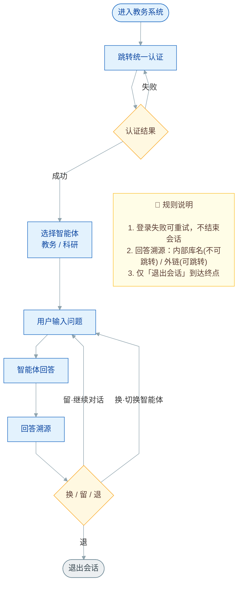
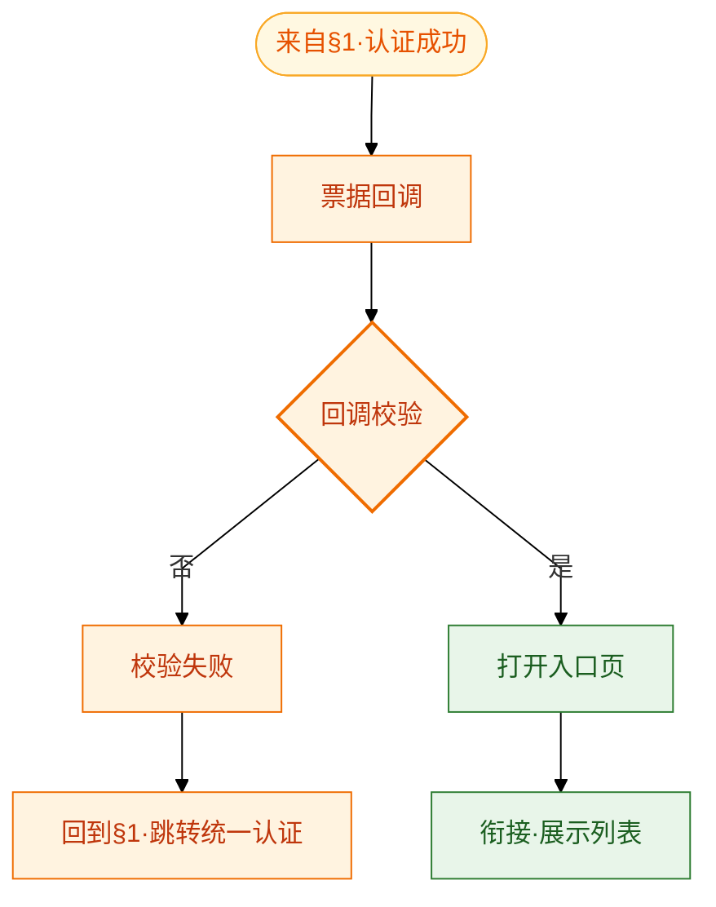
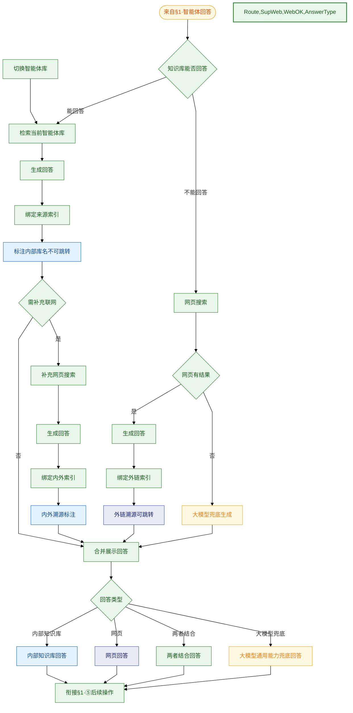
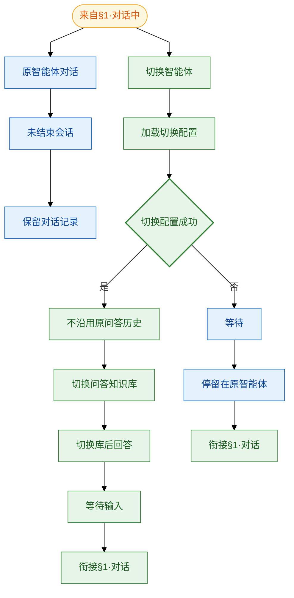
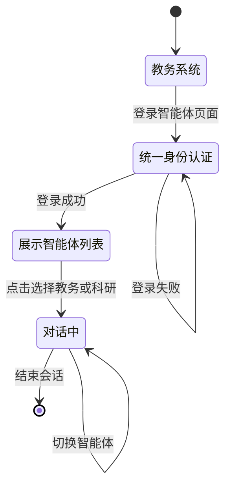
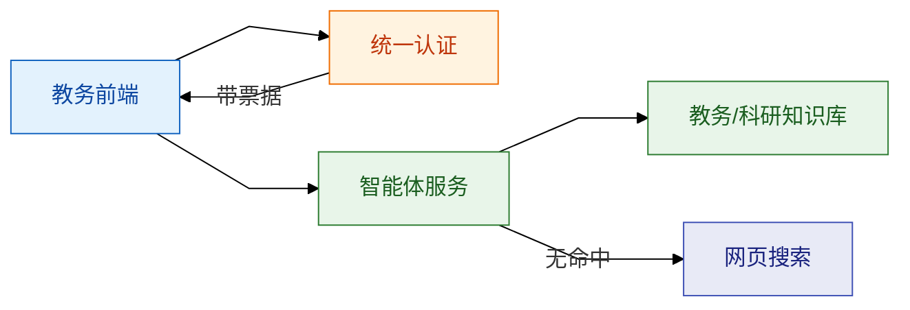

# 教学对话智能体 — 业务流程图

本文档描述教务管理系统内「教学对话智能体」的端到端业务流程。

## 需求覆盖确认

| 需求项 | 是否覆盖 |
|--------|----------|
| 点击后跳转校内统一身份认证 | 是 |
| 登录成功后展示列表、点击选择教务/科研再对话 | 是 |
| 对话中切换：原智能体保留记录；成功则切换知识库，失败则停留原智能体 | 是（§1、§4） |
| 登录成功后可基于知识库对话 | 是 |
| 认证失败提示账号或密码错误 | 是 |
| 能回答时标注内部知识库名称且不可跳转 | 是（§1、§3） |
| 不能回答时网页搜索且外链可跳转 | 是（§1、§3） |
| 登录失败回到登录页（不直接结束） | 是 |
| 多轮提问循环（问完不退出） | 是 |
| 网页搜索后用户可继续提问 | 是 |
| 仅用户主动操作时结束会话 | 是 |
| 合并展示后区分四类回答（内部/网页/两者结合/大模型兜底） | 是（§3） |
| 回答带来源索引 | 是（§3） |
| 内部库示名称不可跳转 | 是（§3） |
| 外部搜索来源可跳转 | 是（§3） |

---

## 1. 主流程（含多轮问答）

主路径与多轮问答合并为一张**自上而下**的单主干业务流程图：**进入教务系统 → 跳转统一认证 → 认证结果 → 选择智能体（教务/科研）→ 用户输入问题 → 智能体回答 → 回答溯源 → 用户选择换/留/退**。认证失败回到统一认证重试；溯源后由用户选择 **换（切换智能体）/ 留（继续对话）/ 退（退出会话）**，仅「退出」到达终点。图**右侧**附**规则说明**栏。

**无框连线文字**：失败、成功、留·继续对话、换·切换智能体、退 等嵌在直线箭头上，无方框；配色克制（主干蓝、判断黄、终点灰、备注浅黄）。

- 复制到 Mermaid Live：见 [教学对话智能体-主流程-无框.mmd](教学对话智能体-主流程-无框.mmd)
- 浏览器直接看图：用浏览器打开 [教学对话智能体-主流程-无框.html](教学对话智能体-主流程-无框.html)



**图例（按步骤着色）**

| 颜色 | 用途 | 节点 |
|------|------|------|
| 蓝 | 流程步骤 | 进入教务系统、跳转统一认证、选择智能体、用户输入问题、智能体回答、回答溯源 |
| 黄 | 判断 | 认证结果、换/留/退（菱形） |
| 灰 | 终点 | 退出会话 |
| 浅黄 | 备注 | 右侧规则说明栏 |

**要点**

- 登录失败：`失败 → 跳转统一认证` 重试，不进入终点；认证成功后的票据回调见 **§2**。
- 智能体选择：认证成功后 **选择智能体（教务 / 科研）** 再进入问答；对话中 **切换智能体** 见 **§4**（原智能体保留记录展示、不沿用原问答历史；切换成功换库回答、失败停留原智能体）。
- 多轮问答：用户输入问题 → 智能体回答 → 回答溯源；主流程**不展开**知识库判定、网页搜索、大模型兜底等内部逻辑，详见 **§3**。
- 回答溯源：内部库名（不可跳转）/ 网页外链（可跳转），详见 **§3**。
- 用户选择：溯源后 **换（切换智能体，回问答）/ 留（继续对话，回问答）/ 退（退出会话，终点）**。
- 右侧 **规则说明** 栏汇总 4 条核心约束，便于评审一眼读取。

---

## 2. 登录对接子流程（§1 认证成功后的补充）

本图**不重复** §1 主流程中的登录前置步骤（进入教务系统 → 登录智能体页面 → 跳转统一认证 → 认证结果 / 失败回流），仅对主流程 **「认证结果 → 成功」** 之后的技术对接做**拉取放大**：

**认证成功 → 票据回调 → 回调校验 → 打开入口页 → 展示智能体列表（衔接 §1）**

- Mermaid 源文件：[教学对话智能体-登录对接子流程.mmd](教学对话智能体-登录对接子流程.mmd)
- 浏览器预览：[教学对话智能体-登录对接子流程.html](教学对话智能体-登录对接子流程.html)



**与 §1 主流程的衔接**

| §1 主流程节点 | 本子流程 |
|---------------|----------|
| 认证结果 -- 成功 --> | 来自§1·认证成功 |
| 展示智能体列表 | 衔接·展示列表（汇入 §1） |
| 认证结果 -- 失败 --> 跳转统一认证 | 校验失败 → 回到§1·跳转统一认证 |

**图例**

| 颜色 | 步骤 | 节点 |
|------|------|------|
| 浅黄 | 承接 §1 | 来自§1·认证成功 |
| 橙 | 票据对接 | 票据回调、校验失败、回到§1 |
| 橙菱形 | 判断 | 回调校验 |
| 绿 | 汇入 §1 | 打开入口页、衔接·展示列表 |

**要点**

- 前置登录（跳转统一认证、提交凭证、认证成功/失败）见 **§1**，本子流程只展开成功后的回调链路。
- **回调校验** 为菱形；是/否 为无框连线文字。
- 校验失败：回到 §1「跳转统一认证」，不进入「会话结束」。
- 回调须保留 `redirect_uri`、`state`；校验通过后打开入口页，再进入 §1「展示智能体列表」。

---

## 3. 问答处理子流程（知识库 + 网页搜索，§1「智能体回答」后的补充）

本图不重复 §1 主流程中的用户可见路径，仅对 **「智能体回答」** 背后的知识库、网页搜索、合并展示与回答类型做补充说明。

**能否回答 → 检索/联网/兜底 → 合并展示回答 → 回答类型（内部/网页/两者结合/大模型兜底）→ 用户下一步**

- Mermaid 源文件：[教学对话智能体-问答处理子流程.mmd](教学对话智能体-问答处理子流程.mmd)
- 浏览器预览：[教学对话智能体-问答处理子流程.html](教学对话智能体-问答处理子流程.html)



**与 §1 主流程的衔接**

| §1 主流程节点 | 本子流程 |
|---------------|----------|
| 智能体回答 | 来自§1·智能体回答 → 内部进行知识库能否回答判定 |
| 回答溯源方式 | 检索或联网或兜底 → **合并展示回答** → 回答类型 |
| 用户选择换/留/退 | 回答类型展示后 → 衔接§1·回答溯源后的用户选择 |

**合并展示后的回答类型（菱形「回答类型」）**

| 类型 | 触发条件（概要） | 展示与溯源 |
|------|------------------|------------|
| **内部知识库回答** | 知识库能回答且无需补充联网 | 标注内部库名，不可跳转 |
| **网页回答** | 知识库不能回答，网页搜索有结果 | 外链溯源，可跳转 |
| **两者结合回答** | 知识库能回答但需补充联网检索 | 内部库名 + 外链索引同条展示 |
| **大模型兜底回答** | 知识库不能回答且网页无有效结果 | 由大模型直接生成，可无外链或弱溯源 |

**图例**

| 颜色 | 步骤 |
|------|------|
| 浅黄 | 承接 §1、大模型兜底 |
| 绿 | 检索、生成、合并、展示、衔接 |
| 绿菱形 | 能否回答、需补充联网、网页有结果、回答类型 |
| 蓝 | 内部库名 / 内部知识库回答 |
| 靛蓝 | 外链 / 网页回答 |

**要点**

- 所有生成结果先进入 **合并展示回答**，再按 **回答类型** 四类之一渲染气泡与来源区。
- **两者结合**：内部命中为主，再 **补充网页搜索** 补全依据（原型示例 3 混合溯源）。
- **大模型兜底**：无有效知识库与网页检索结果时使用，**不展示教务处人工电话**（若二期需要可单独立项）。
- **切换智能体** 后由 §4 切换知识库，经 `切换智能体库` 进入本流程，详见 **§4**。

---

## 4. 智能体选择与切换子流程

§1 已含首次 **展示智能体列表 → 点击选择 → 进入对话**。本子流程自 §1 对话中 **平行** 分出两路：**原智能体对话** 与 **切换智能体**（非父子关系）。切换路：加载配置 → 成功则换库回答，失败则等待并停留原智能体。首次选择与登录衔接见 §1、§2。

- Mermaid 源文件：[教学对话智能体-智能体选择子流程.mmd](教学对话智能体-智能体选择子流程.mmd)
- 浏览器预览：[教学对话智能体-智能体选择子流程.html](教学对话智能体-智能体选择子流程.html)



**平行两路（自 §1 对话中同时分出）**

```text
来自§1·对话中
├── 原智能体对话 → 未结束会话 → 保留对话记录
└── 切换智能体 → 加载切换配置 → 切换配置成功?
         ├─ 是 → 切换问答知识库 → 切换库后回答 → 等待输入
         └─ 否 → 等待 → 停留在原智能体
```

| 平行分支 | 条件 / 行为 |
|----------|-------------|
| **原智能体对话** | **未结束会话**；**保留对话记录** |
| **切换智能体** · 成功 | **切换配置成功** → 切换问答知识库 → 回答（§3）→ 等待输入 |
| **切换智能体** · 不成功 | **等待** → **停留在原智能体** |

**与 §1 / §3 衔接**

| 节点 | 说明 |
|------|------|
| §1 切换智能体 | 用户选择·换（切换智能体）→ 本子流程 |
| §3 切换库后回答 | 配置成功 → 切换问答知识库 → 走 §3 问答处理 |
| 配置不成功 | 停留原智能体，不进入 §3 新库检索 |
| 首次选择 | §1：展示列表 → 点击选择 → 进入对话 |

**图例**

| 颜色 | 步骤 |
|------|------|
| 浅黄 | 承接 §1 |
| 蓝 | 原智能体对话、配置失败停留 |
| 绿 | 切换智能体、配置成功路径 |

**要点**

- **平行关系**：**原智能体对话** 与 **切换智能体** 自「来自§1·对话中」**同级平行**分出，互不包含。
- **原智能体路**：**未结束会话** + **保留对话记录**，不因切换尝试清空气泡。
- **切换成功**：换 **问答知识库**，新问题 **不沿用** 原问答上下文。
- **切换失败**：**等待** 并 **停留在原智能体**。

---

## 5. 端到端状态视图



---

## 6. 业务规则对照表

| 需求 | 流程图中的体现 |
|------|----------------|
| 点击后走统一身份认证 | 登录智能体页面 → 跳转认证（§1） |
| 认证失败错误提示 | 失败 → 账号或密码错误提示 → 认证页 |
| 票据回调与校验 | §1 认证成功 → §2 票据回调 → 回调校验 → 打开入口页 |
| 选择教务/科研智能体 | 认证成功 → 展示列表 → 点击选择 → 进入对话 |
| 对话中切换智能体 | §4：原智能体保留记录；成功→切换知识库；失败→停留原智能体 |
| 登录成功后可对话 | 进入对话 → 用户输入问题 → 智能体回答 |
| 智能体回答 | §1 用户输入问题 → 智能体回答；内部处理见 §3 |
| 回答溯源方式 | §1 两类溯源：内部知识库 / 网页来源 |
| 回答溯源 | §1 回答溯源（内部库名不可跳转 / 外链可跳转）；细节见 §3 |
| 回答来源索引 | §3 绑定索引 → 合并展示 → 回答类型 |
| 四类回答展示 | §3：内部库 / 网页 / 两者结合 / 大模型兜底 |
| 用户选择换/留/退 | 溯源后 → 换（切换智能体，回问答）/ 留（继续对话，回问答）/ 退（退出会话） |
| 登录失败不结束 | 失败 → 认证页 |
| 多轮提问 | ⑤ 继续对话 → ④ 用户输入问题 |
| 回答后仍可问 | ⑤ 继续对话 |
| 会话结束 | ⑤ 退出会话 → 灰色终点 |

---

## 7. 系统架构（实现参考）



---

## 8. 补充说明（PRD 细节）

### 8.1 会话结束与超时策略

| 场景 | 行为 | 是否算「会话结束」 |
|------|------|-------------------|
| 用户点击「结束会话」 | 清除会话态；可选服务端归档 | 是 |
| 关闭标签页 | 下次进入按校内策略重新认证 | 视产品而定 |
| 无操作约 30 分钟 | 提示超时；可选继续或退出 | 可配置 |
| 登录失败 | 停留认证页可重试 | 否 |

### 8.2 不能回答时的网页搜索

- 当 **知识库能否回答 = 否** 时，系统执行 **网页搜索**，生成回答并附 **可跳转外链** 索引（详见 §3 不能回答分支）。
- **用户选择换/留/退**：换（切换智能体）/ 留（继续对话）/ 退（退出会话）；切换细节见 **§4**。
- 原「教务处人工电话」兜底方案 **本期不采用**；若二期需要可单独补充流程节点。

### 8.3 统一身份认证要点

- 协议：与现网一致（CAS / OAuth2-OIDC）。
- 入口 URL 带 `redirect_uri`、`state`（标记来源=智能体）。
- **认证失败**：提示 **账号或密码输入错误**，停留认证页可重试；不展示「会话已结束」。
- 成功回调至智能体选择页，选定后再进入对话页。

### 8.4 智能体选择与切换

- 登录成功后 **展示智能体列表**（教务、科研等入口），用户 **点击选择** 后再进入对话页（§1）。
- 对话中 **切换智能体**（§4）：**原智能体** 侧保持未结束会话并 **保留对话记录**；**切换到的智能体** 加载配置，**成功** 则切换问答知识库并按 §3 回答，**不成功** 则 **等待** 并 **停留在原智能体**。

### 8.5 问答展示与溯源（与 §3 对应）

合并展示后按 **回答类型** 渲染，共四类：

| 类型 | 数据来源 | 溯源规则 |
|------|----------|----------|
| 内部知识库回答 | 仅当前智能体知识库 | `source_type=internal`，展示库名，**不可跳转** |
| 网页回答 | 仅网页搜索 | `source_type=external`，`title` + `url`，**可跳转** |
| 两者结合回答 | 知识库 + 补充联网 | 内部与外链 **连续编号** 同条展示（见原型混合溯源） |
| 大模型兜底回答 | 大模型直接生成 | 可无来源或弱提示；不替代人工电话（本期） |

---

## 9. 修订记录

| 版本 | 日期 | 说明 |
|------|------|------|
| 2.20 | 2026-06-03 | §1 主流程改为自上而下用户可见链路；进入对话后删除内部判定逻辑，仅保留输入、回答与两类溯源 |
| 2.31 | 2026-06-03 | §1 ④ 紫色、⑤ 靛蓝色节点；③ 保持绿色 |
| 3.0 | 2026-06-04 | §1 重做：自上而下单主干、去子图框、配色精简为蓝/黄/灰、直角线，新增右侧规则说明栏 |
| 2.30 | 2026-06-03 | §1 ⑤ 菱形改为「用户选择换/留/退」；删分支连线文字，保留三操作节点 |
| 2.28 | 2026-06-03 | §1 新增独立框「⑤ 后续操作」：下一步→继续对话/切换智能体/退出会话 |
| 2.27 | 2026-06-03 | §1 删除「下一步操作」及继续对话/切换智能体/退出会话三分支 |
| 2.23 | 2026-06-03 | §1 ④多轮对话自上而下：输入→回答→溯源→用户动作；结束节点改为「退出会话」 |
| 2.22 | 2026-06-03 | §1 主流程改为四段 subgraph 横向排版；认证/对话回环区块内纵向；曲线 basis、间距优化 |
| 2.21 | 2026-06-03 | §1 对话区简化：合并溯源为单节点「回答溯源」；删除 TraceType 菱形及 InternalTrace/ExternalTrace |
| 2.20 | 2026-06-03 | §1 主流程改为自上而下用户可见链路；进入对话后删除内部判定逻辑，仅保留输入、回答与两类溯源 |
| 2.19 | 2026-06-03 | §4 原智能体对话与切换智能体改为自对话中平行两路（同级） |
| 2.18 | 2026-06-03 | §4 原智能体对话与切换到的智能体改为并列两路 |
| 2.17 | 2026-06-03 | §4 切换下分原智能体/切换到的智能体；成功换库回答、失败停留原智能体 |
| 2.16 | 2026-06-03 | §3 合并展示后增加回答类型四类：内部/网页/两者结合/大模型兜底 |
| 2.15 | 2026-06-03 | §3 合并知识库问答与网页搜索为「问答处理子流程」；取消 §3b |
| 2.14 | 2026-06-03 | §4 明确未结束会话、保留原对话展示、不沿用原问答历史、切换问答知识库 |
| 2.13 | 2026-06-03 | §1 节点「点击智能体」改为「登录智能体页面」 |
| 2.12 | 2026-06-03 | §1 认证失败提示；能答标内部库名/不能答网页搜索；用户下一步菱形；新增§3b；取消主流程人工电话 |
| 2.11 | 2026-06-03 | §1/§4 节点「右下角切换智能体」改为「切换智能体」；UI 位置保留在 §4/§8.4 说明 |
| 2.10 | 2026-06-03 | §1 补充展示智能体列表→点击选择→进入对话；§2 衔接节点对齐 |
| 2.9 | 2026-06-03 | §4 精简为右下角切换+保留历史仅展示；§1/§5/§8.4 对齐 |
| 2.8 | 2026-06-03 | §1 对话中切换智能体；§3 切换知识库；新增§4 切换子流程 |
| 2.7 | 2026-06-03 | 新增§3知识库问答子流程（溯源/内外部来源） |
| 2.6 | 2026-06-03 | §2 收窄为§1认证成功后的票据回调补充子流程 |
| 2.5 | 2026-06-03 | 流程图框内文字精简 |
| 2.4 | 2026-06-03 | 新增登录对接子流程（含跳转认证、双菱形判断） |
| 2.3 | 2026-06-03 | 认证结果改菱形判断，配色与跳转认证一致 |
| 2.2 | 2026-06-03 | 增加登录后选择教务/科研智能体步骤 |
| 2.1 | 2026-06-03 | 认证结果与跳转统一身份认证登录页同色 |
| 2.0 | 2026-06-03 | 进入对话界面、等待用户输入与用户下一步同色 |
| 1.9 | 2026-06-03 | 失败/成功等连线文字无方框，直线嵌字 |
| 1.8 | 2026-06-03 | 连线粗细调整为 1px |
| 1.7 | 2026-06-03 | 全部流程图连线与箭头改为黑色 |
| 1.6 | 2026-06-03 | 认证结果改矩形无菱形外框；失败/成功连线无框 |
| 1.5 | 2026-06-03 | 判断节点与用户下一步显式同色；文案改为「进行回答」 |
| 1.4 | 2026-06-03 | 展示教务人工电话配色与展示智能体回答一致（绿色） |
| 1.3 | 2026-06-03 | 兜底节点改为展示教务人工电话 |
| 1.2 | 2026-06-03 | 连线文字改无框语法；新增 .mmd / .html |
| 1.1 | 2026-06-03 | 合并主流程与多轮问答为单图；按步骤节点着色 |
| 1.0 | 2026-06-03 | 初版 |
